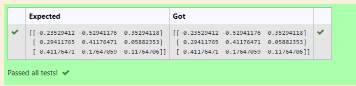

# INVERSE-OF-A-MATRIX
## Aim:
To write a python program to find the inverse of a matrix
## Equipment’s required:
1. 	Hardware – PCs
2. 	Anaconda – Python 3.7 Installation / Moodle-Code Runner
## Algorithm:
### Step1 : import a python library called numpy
### Step 2: assign numpy array
### Step 3:  using np.linalg.inv(A)) print  the inverse of the matrix 
### Step 4: end the program

## Program:
```
#Program to find the inverse of a matrix.
#Developed by: Sowmiya N
#RegisterNumber:21500134
import numpy as np
A=np.array([[1,0,3],[-1,2,-2],[2,3,-1]])
print(np.linalg.inv(A)) 
```
## Output:

## Result:
Thus the inverse of given matrix is successfully solved using python program

